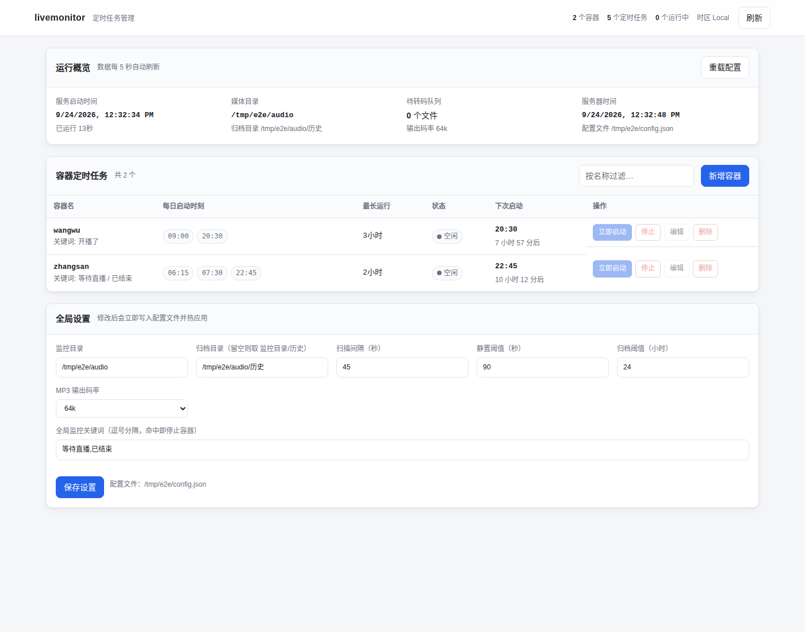

# livemonitor

用 Go 重写的直播容器监控与媒体压缩服务。原 Python 脚本（`livemonitor.py`）依赖
`schedule`、`mutagen`、`shutil` 等第三方库，并调用外部 `ffmpeg` 与 `docker` 命令；
Go 版本把这些都换成了进程内的实现，运行镜像只需一个几 MB 的 alpine。

功能与原脚本一致：

1. **定时启动容器** — 每个容器可配置多个每日启动时刻，到点自动启动容器。
2. **日志关键词监控** — 实时跟踪容器日志，命中关键词（默认 `等待直播`）立即停止容器；
   另有**启动回溯检查**兜底（见下文）。
3. **最大运行时长保护** — 到达设定时长后自动停止容器。
4. **MP3 压缩** — 监控目录中的 MP3 自动压到目标码率（默认 32k / 立体声 / 44100Hz）。
5. **过期文件归档** — 早于阈值的 MP3 自动移入 `历史` 子目录。
6. **Web 管理界面** — 浏览器里增删改定时任务、查看运行状态、调整全局设置，改动即时生效并写回磁盘。

## 几个容易踩的语义

### 启动回溯检查：给关键词监控加一道保险

容器被拉起（含接管）后 30 秒内，程序会**一次性回查最近一分钟的日志**，
命中关键词就立即停止容器。原有的实时日志监控保持不变，两者并行：

| 机制 | 覆盖范围 | 失效场景 |
| --- | --- | --- |
| 实时监控（`docker logs --follow`） | 日志流建立之后的全部输出 | 流建立失败时彻底失效 |
| 启动回溯检查（一次性） | 最近一分钟的历史日志 | 仅在启动后 30 秒窗口内有效 |

之所以要这道保险：容器内应用往往**一启动就打印**"等待直播"（实测约 5 秒），
而日志流若因故没建立起来（网络抖动、Engine 短暂不可达），实时监控就成了摆设，
容器会一直挂着。有了回查，最迟启动后 30 秒也能把它停掉。

窗口起点不会早于本次启动——docker 的 json 日志在容器停止后并不会被清空，
往前多看一秒都可能读到上一轮运行留下的"等待直播"，把刚拉起的容器误杀。

**配套行为**：程序启动时会主动接管"配置里有、Docker 说在跑、但本进程没在跟踪"
的容器。没有这一步，进程重启后上一轮的容器会因"今天的计划已执行过"而被
调度器跳过，陷入无人监控状态——回溯检查也就永远轮不到执行。
接管只是挂上监控，不会重新启动任何容器。

### 日志监控的两个隐蔽陷阱：tail=0 与 TTY

关键词监控的实时流和回溯检查都依赖 Engine 的日志接口，这里有两个语义坑，
都曾导致"监控不到包含等待直播的日志"：

**`tail=0` 的真实语义是"0 行历史"，不是"不限制"。** Engine 处理日志请求时
先按 tail 截断历史、再按 since 过滤：带 `tail=0` 的请求无论 `since` 写什么，
历史部分都是空的。而关键词监控恰恰需要回放——日志流建立总要晚于
`docker start` 返回，应用一启动就打印的"等待直播"全在历史里，
带 `tail=0` 等于把监控的第一道网整个剪断。因此带 `since` 的请求一律
省略 `tail`；只有明确"不要历史"的场景才用 `tail=0`。

**TTY 容器的日志流没有帧头。** `docker run -t`（或 compose `tty: true`）
的日志流是原始字节流，没有那 8 字节帧头；按帧解析会把日志文本当成帧长字段
（比如"等待直播"的 UTF-8 前 8 字节会被解读成"读取约 32 亿字节"），
结果是一行都解不出来。程序会在挂流前查询容器的 Tty 属性：
TTY 容器按原始行读取（行尾 `\r\n` 一并剥掉），普通容器仍按帧解复用。

两个坑的共同点：接口都返回 200，监控 goroutine 看起来在"正常运行"，
只是永远等不到那行日志——不对照 Engine 的行为逐一验证很难想到是参数问题。

### 启动前清理历史日志

程序在**启动容器之前**会先清空该容器的 json 日志文件，然后再 `docker start`：

1. 上一轮的关键词不会残留到本轮的回放与回查里——杜绝"刚拉起就被上一轮
   残留日志误杀"的可能；
2. 日志文件不随反复重启无限膨胀。

清理只在容器**停止**状态下进行（正在运行、可能处于监控中的容器一律拒绝），
截断是安全的：json-file 驱动以追加模式写入，截断后新日志从文件头继续。

**这是"尽力而为"的能力**：Docker Engine 没有截断日志的 API，程序直接截断
inspect 返回的宿主机日志文件路径（`LogPath`）。因此：

- livemonitor **跑在宿主机上**：天然可用；
- livemonitor **跑在容器里**：需要额外读写挂载宿主机日志目录：

  ```bash
  docker run -d --name livemonitor \
    -v /var/run/docker.sock:/var/run/docker.sock \
    -v /var/lib/docker/containers:/var/lib/docker/containers \
    ...
  ```

- 未挂载（默认）时该步骤自动跳过并打印一条说明日志，不影响任何功能——
  监控本来就以本轮启动时刻为界，上一轮日志不会被误读。

> 读写挂载宿主机的容器日志目录意味着 livemonitor 可以截断**所有**容器的
> 日志文件（虽然它只会动自己配置里的容器）。介意的话可以不挂载，接受跳过。


### 容器已在运行时：接管，而不是跳过

定时任务到点时，如果容器已经处于运行状态（用户手动起的、上次进程退出后残留的、
或 `restart: unless-stopped` 自动拉起的），程序**不会**跳过这次计划，而是**接管**它：
继续做日志关键词监控与超时保护，并按容器的**真实启动时间**继续计时。

如果按真实启动时间算已经超过 `max_run_duration`，接管后会立即停止它——
这个容器本来就该停了，不该因为被接管而重新获得一整轮运行时长。

**接管不只在程序启动时发生。** 程序运行期间会持续订阅 Docker Engine 的
事件流（`type=container` 且 `action=start/restart`，在服务端过滤），
任何人——或 `restart: unless-stopped` 之类的策略——在程序运行期间
启动了配置里的容器，都会被实时发现并接管监控；事件流断开时按固定间隔重连。
配置之外的容器的启动事件一律忽略，不会越权接管别人的容器。

> 三条路径殊途同归，最终都走同一个 Start 的接管分支：
> ① 程序启动时发现容器已在运行；② 运行期间收到外部启动事件；
> ③ 定时任务到点时容器已在运行。Start 内部做了互斥与幂等，
> 本程序自己的启动事件也会经过事件流流回，但会被"已跟踪"检查拦下，
> 同一容器不会被双重接管。

> 早期版本在这里是"跳过本次计划"，那是个设计错误：跳过意味着既不做关键词监控、
> 也不做超时停止，容器会一直跑下去直到有人手动停它。
> "容器正在运行"和"今天的计划已经执行过"是两件事，不能混为一谈。

**代价**：如果你手动起了一个需要长期运行的容器，而它又在本程序的配置里，
那么到点后它会被接管并在超时后停掉。这类容器不应配在 `containers` 里。

### 当天已执行记录会落盘

"今天是否已经执行过"记录在 `scheduler-state.json`，位置与配置文件同级
（配置在 `/config/config.json`，状态就在 `/config/scheduler-state.json`）。
只保留当天的条目，昨天的记录在启动时会被丢弃。

> 这个记录**必须**持久化。放在内存里的话，进程重启或任何配置热更新
> （`Reload` 会重建全部 Job 对象）都会把它清零，导致当天所有已过点的任务
> 被重放一遍——现象是同一批容器在几分钟内被反复启动，日志里出现多条
> "容器已在运行"。

Web 界面的**立即执行**不受此记录限制，是人的显式意图。

> 注意这个文件**只记录调度器触发过的任务**。通过界面手动启动的容器不进这里，
> 因为它不代表"今天的计划已经跑过了"。所以看到文件不存在或为空，
> 并不一定意味着异常——如果你从没让调度器自动跑过任务，它本来就是空的。

### 状态以 Docker 为准，不信内存记账

容器被 `docker stop`、自己退出或崩溃时，本程序**收不到任何通知**。
因此内部维护的"是否在运行"会在这些情况下停留在旧值——界面一直显示"运行中"，
点启动被拒（"已在运行中"），点停止也被拒（"未在运行"）。

为此，所有对外汇报状态、以及任何"要不要启动/停止"的判断，都会先向 Docker
查一次真实状态（`ContainerMonitor.SyncState`），并据此纠正内部记账。
查询失败时保守沿用旧值：宁可短暂显示旧状态，也不要因为一次网络抖动
就把运行中的容器标成已停止。

代价是每次状态查询多一次 inspect 调用。容器在几十个的量级、状态接口只在
打开界面或轮询时触发，可以接受。

## 设计取舍

### 关于外部程序

| 原先依赖 | 现在的做法 | 收益 |
| --- | --- | --- |
| `docker` CLI（约 31MB 静态二进制） | 标准库经 unix socket 直接调 Docker Engine API | 镜像不再需要 CLI |
| `ffmpeg`（官方静态构建约 130MB） | 自编译裁剪版：只保留 mp3 解封装 + LAME 编码 | 二进制 **1.4MB**，镜像 18MB |
| `mutagen`（Python 库） | `internal/media/mp3.go` 自行解析 MPEG 帧头 | 无第三方运行时依赖 |

### 为什么最终还是用了 ffmpeg

早期版本试过"纯 Go 转码"（`go-mp3` 解码 + `shine-mp3` 编码）。能跑通，
但代价太大：

- **慢**：同一份 30 秒素材，纯 Go 约 0.38s，ffmpeg 约 0.14s（快 2.7 倍）。
  批量处理几十个文件时差距会放大到分钟级。
- **音质弱**：`shine-mp3` 官方定位就是"能听、文件更大、质量不如 LAME"。
- **参数被绑死**：为了绕开 resample 的实现成本，输出被迫固定在
  22050Hz / 单声道，等于在用户不知情的情况下丢了一半声道和高频。

改用 ffmpeg 后这三点同时解决，而且通过**裁剪构建**把体积代价压到可忽略：
`--disable-everything` 只开 `mp3` 解封装、`mp3` 编码（libmp3lame）、`file` 协议，
静态链接 musl，**1.4MB**。相对完整版省下约 128MB，相对纯 Go 方案只多 2.9MB
（镜像 15.6MB → 18.5MB）。

换来的是：44100Hz 立体声输出（保持输入规格）、真正的 LAME 编码质量、
全项目零第三方 Go 依赖（`go.mod` 无任何 `require`）。

> 二进制与许可证原文随仓库提供：`docker/ffmpeg`、`docker/COPYING.LGPLv2.1`，
> 来源与校验值见 `docker/README-ffmpeg.md`。
> ffmpeg 以 LGPLv2.1 授权，静态链接的分发需要随附许可证原文——已包含在镜像内
> `/usr/local/share/doc/ffmpeg/COPYING.LGPLv2.1`。

### 代价

- **只支持 MP3 作为输入**。裁剪版只编译了 mp3 解封装，TS/AAC/FLAC 等格式
  扫描到时会给出一条告警日志，提示先转成 MP3。需要直接从 TS 转码的场景
  不适合本程序。
- 镜像需随附 LGPL 许可证文本（已处理，见上）。


## 与原脚本的对应关系

| Python 实现 | Go 实现 | 说明 |
| --- | --- | --- |
| `schedule.every().day.at()` | `internal/scheduler` | 按秒轮询，按「日期 + 时刻」去重，避免同一时刻重复触发 |
| `mutagen.mp3.MP3().info.bitrate` | `internal/media/mp3.go` | 自行解析 MPEG 帧头，跳过 ID3v2 标签，含二次帧校验防误判 |
| `subprocess.run/Popen` | `internal/dockerctl`、`internal/media` | 全部改为 `context` 驱动，支持超时与优雅取消 |
| `subprocess.run(["docker", ...])` | `internal/dockerctl` + Docker Engine API | 直接用标准库经 unix socket 调 Engine API，镜像内不再需要 docker CLI |
| `subprocess.run(["ffmpeg", ...])` | `internal/media/transcoder.go` | 调用镜像内自带的裁剪版 ffmpeg（1.4MB），通过退出码区分"格式不支持"与"文件读不到" |
| `threading.Thread` + `Event` | goroutine + `context.Context` | 用 context 取消替代 Event 信号，避免竞态 |
| `re.compile(r'[\x00-\x1F\x7F]')` | `monitor.CleanLogLine` | 逐 rune 扫描，保留制表符 |
| `shutil.move` | `media.moveFile` | 先 `rename`，跨分区时回退为复制 + 删除 |
| 硬编码 `CONTAINERS_CONFIG` | `config.json` + Web 界面 | 配置外置，支持校验、容器级关键词覆盖、运行时热更新 |

> 除下面两处外，其余全部为标准库：
> - MP3 帧头解析（`internal/media/mp3.go`）为自研，无第三方依赖；
> - 音频转码通过子进程调用镜像内自带的裁剪版 ffmpeg（非 Go 依赖，故 `go.mod` 为空）。


## 快速开始

```bash
# 1. 生成配置
go run ./cmd/livemonitor init -config config.json

# 2. 校验配置（会打印解析结果与生效参数）
go run ./cmd/livemonitor check -config config.json

# 3. 启动服务（默认开启 Web 管理界面 :8080）
go run ./cmd/livemonitor run -config config.json -log-level info
```

编译单文件二进制：

```bash
make build            # 产出 bin/livemonitor
```

## 命令行

```
livemonitor run     启动监控服务（含 Web 管理界面）
livemonitor init    生成默认配置文件
livemonitor check   校验配置并打印摘要
livemonitor probe   查看 MP3 文件码率等参数
livemonitor version 查看版本
```

通用选项：`-config <路径>`、`-log-level debug|info|warn|error`。

`run` 专属选项：

| 选项 | 默认值 | 说明 |
| --- | --- | --- |
| `-web <地址>` | `:8080` | Web 管理界面监听地址，填 `off` 可禁用 |
| `-force` | `false` | 配置校验失败时仍尝试启动（仅告警） |

## Web 管理界面

启动后访问 `http://<主机>:8080` 即可管理定时任务，无需手工编辑 JSON。



能做什么：

| 区域 | 功能 |
| --- | --- |
| 运行概览 | 启动时间、已运行时长、媒体目录、待处理队列、服务器时间与配置文件路径 |
| 容器定时任务 | 每个容器的每日启动时刻、最长运行时长、运行状态与剩余时间、下次启动倒计时 |
| 容器操作 | **立即启动**（跳过计划手动跑一次）、**停止**、**编辑**、**删除** |
| 全局设置 | 监控目录、归档目录、扫描间隔、静置阈值、归档阈值、MP3 码率、全局关键词 |
| 重载配置 | 手工改完 `config.json` 后一键热应用，不必重启进程 |

设计要点：

- 所有写操作都**先落盘再热应用**。配置通过「写临时文件 + `rename`」原子替换，避免写一半损坏配置。
- 落盘后的 `config.json` 权限固定为 `0644`。容器默认以 root 运行、配置又常从宿主机挂载进去，
  若权限被收窄到 `0600`，用 Web 改一次设置后宿主机的普通用户就再也读不了自己的配置
  （表现为 `cat` 报 Permission denied，甚至编辑器打不开），而界面上却显示"保存成功"。
- 启动时刻在保存时自动**去空白、去重、升序**；容器名重复视为更新而非新增。
- 编辑某个容器的时刻后，该容器的旧调度任务会被精确摘除再重建，不会残留已删除的时间点。
- 页面每 5 秒自动刷新；配置为纯静态 HTML（`go:embed` 内嵌），单文件二进制即可运行。
- 路径参数按原始编码（`EscapedPath`）切分，容器名中的非法字符（`/`、`\`、`..`）会被拒绝。

> ⚠️ **该界面没有任何鉴权**，任何能访问该端口的人都可以启停你的容器、修改配置。
> Docker 部署时默认只绑定 `127.0.0.1`，需要远程访问请自行加反向代理与访问控制，
> 或把 `LIVEMONITOR_WEB_ADDR` 设为 `off` 关闭界面。

## 配置说明

见 [`config.example.json`](config.example.json)。关键字段：

| 字段 | 默认值 | 说明 |
| --- | --- | --- |
| `watch_dir` | `/audio` | 媒体监控目录（容器内路径，建议卷挂载） |
| `history_dir` | `<watch_dir>/历史` | 归档目录，留空则按默认推导 |
| `check_interval` | `30` | 目录扫描间隔（秒） |
| `stable_delay` | `60` | 文件最后修改后需静置的秒数，防止处理仍在写入的文件 |
| `archive_after_hours` | `45` | 归档阈值（小时） |
| `mp3_bitrate` | `32k` | 可选 `16k/24k/32k/48k/64k/96k/128k` |
| `monitor_keywords` | `["等待直播"]` | 全局日志监控关键词 |
| `containers[].start_times` | — | `"20:01"` 或 `["17:03","17:13"]` 两种写法均可 |
| `containers[].max_run_duration` | `3600` | 最大运行秒数 |
| `containers[].keywords` | 继承全局 | 容器级关键词覆盖 |

### 关于时间与时区

原脚本用 `datetime.utcnow()` 做年份守卫，并对齐的是**容器本地时间**。Go 版本直接使用
`time.Local`（容器内由 `TZ` 环境变量决定，Dockerfile 默认 `Asia/Shanghai`），
并在启动日志中打印当前时区与下一个计划启动时刻，避免时区错位。

## Docker 部署

```bash
docker build -t livemonitor:1.0.0 .

docker run -d --name livemonitor \
  -v /var/run/docker.sock:/var/run/docker.sock \
  -v /你的媒体目录:/audio \
  -v /你的配置目录:/config \
  -p 127.0.0.1:8080:8080 \
  -e TZ=Asia/Shanghai \
  -e PUID=1000 -e PGID=1000 \
  --restart unless-stopped \
  livemonitor:1.0.0
```

或使用 docker compose：

```bash
docker compose up -d
```

**必须挂载 `/var/run/docker.sock`**，否则无法控制宿主机容器（MP3 压缩仍可工作）。
程序通过 Docker Engine API 直接与 socket 通信（HTTP over unix socket），**镜像内不安装
docker CLI**，因此体积比走命令行的方案小约 31MB。

> 挂载 socket 等同于把宿主机 Docker 的控制权交给容器，请勿把 Web 管理界面直接暴露到公网。
> 若确实需要更严格的隔离，可改用只读 socket 或 docker-socket-proxy 转发。

环境变量：

| 变量 | 默认值 | 说明 |
| --- | --- | --- |
| `LIVEMONITOR_CONFIG` | `/config/config.json` | 配置文件路径 |
| `LIVEMONITOR_LOG_LEVEL` | `info` | 日志级别 |
| `LIVEMONITOR_WEB_ADDR` | `:8080` | Web 界面监听地址，设为 `off` 禁用 |
| `DOCKER_HOST` | `unix:///var/run/docker.sock` | Docker Engine API 的 socket 路径（仅支持 unix://） |
| `TZ` | `Asia/Shanghai` | 时区（影响所有定时任务的判定） |
| `PUID` / `PGID` | 未设置 | 同时设置则以该 UID/GID 运行，便于处理挂载目录属主 |

## 测试

测试分两层：**单元测试**验证逻辑，**端到端测试**验证"打出来的镜像能不能用"。

### 单元测试

```bash
make test              # 全部单元测试
make test-race         # 竞态检测（CI 用这个）
```

不依赖网络，也不需要 ffmpeg——测试素材由 `go-mp3` / `shine-mp3` 现场合成：

- `internal/dockerctl` 用临时 unix socket 起一个假的 Engine API 服务，覆盖探活、启停、
  日志帧解析与请求路径转义；
- `internal/monitor` 使用假的客户端与可控日志流驱动关键词匹配；
- `internal/media` 覆盖帧头解析（含 Xing/Info 信息帧跳过）、解码、重采样、重编码与产物校验；
- `internal/runtime` 验证配置热更新的原子落盘与并发安全；
- `internal/web` 通过假控制器覆盖全部 HTTP 接口（含错误路径与路径穿越防护）。

### 端到端测试

```bash
make e2e               # 构建镜像后跑全流程（需要本机 docker）
IMAGE=tototao/livemonitor:latest bash scripts/e2e.sh   # 直接测已有镜像
```

约 92 项断言，覆盖 10 个方面：

| 分组 | 验证内容 |
| --- | --- |
| 镜像内容 | 确认 `ffmpeg` **存在且为裁剪版**（无 lavfi，防止被换成 130MB 完整版）、随附 LGPL 许可证、`docker`/`dockerd`/`ffprobe` 不存在、时区数据可用 |
| 素材准备 | 用宿主机的 ffmpeg 造多种码率、立体声、带/不带 Xing 头的测试文件 |
| CLI 子命令 | `init` / `check` 的行为与错误提示（含重复 init 拒绝覆盖） |
| 压缩主流程 | 日志关键节点、不支持格式告警**且去重**（周期性扫描不应刷屏） |
| 产物校验 | 采样率/声道/码率/时长/压缩比，并验证低码率文件**被跳过** |
| 容器内直连转码 | 绕过服务直接调镜像内的 ffmpeg：验证静态链接可用、重复转码不膨胀、退出码可区分错误类型 |
| Web 界面 | 首页、`/api/state`、改设置写回磁盘、非法输入返回 400 |
| 容器控制 | 真实 Engine API 启停容器、启动前清空容器 json 日志（未挂载时自动跳过）、接管已运行容器、**运行期间订阅 Engine 事件流实时接管外部启动的容器**、外部停止后状态以 Docker 为准、启动回溯检查在接管后 30 秒内执行、实时流回放启动以来的历史（不带 tail）、TTY 容器按原始行解析 |
| 优雅退出 | SIGTERM 后正常退出并打印停止流程 |

想单独对真实 Docker 测 Engine API 客户端：

```bash
docker run -d --name livemonitor-selftest alpine:3.22 \
  sh -c 'while true; do echo "测试日志 $(date)"; sleep 2; done'
LIVEMONITOR_DOCKER_E2E=1 go test -run TestLive -v ./internal/dockerctl/
docker rm -f livemonitor-selftest
```

> 端到端测试不是摆设。它实际抓到过一个只有真实容器才暴露的 bug：
> LAME 写入的 Xing/Info 信息帧头里码率字段与实际音频不符（32k 的文件里写着 56k），
> 导致低码率文件每轮扫描都被重压一遍。纯逻辑测试造不出这种素材。

## 项目结构

```
cmd/livemonitor/          程序入口
internal/cli/             子命令与参数解析
internal/config/          配置定义、加载、校验
internal/logging/         带作用域前缀的并发安全日志
internal/dockerctl/       Docker Engine API 客户端（unix socket + HTTP，无 CLI 依赖）
internal/scheduler/       每日定点调度（支持按 ID 精确增删）
internal/monitor/         容器生命周期监控
internal/media/           MP3 帧头解析（跳过 Xing/Info 信息帧）、调 ffmpeg 重编码、目录扫描与归档
internal/runtime/         可热更新的并发安全配置存储（原子落盘）
internal/web/             Web 管理界面与 JSON API（go:embed 内嵌页面）
internal/manager/         编排各组件、Web 服务与信号处理
scripts/verify-embed.sh   校验二进制内嵌了 Web 页面（CI 用）
scripts/e2e.sh            容器级端到端测试（约 80 项断言）
docker/ffmpeg             自编译的裁剪版 ffmpeg（1.4MB，MP3→MP3 专用）
docker/COPYING.LGPLv2.1   ffmpeg 的 LGPL 许可证原文（合规随附）
docker/README-ffmpeg.md   二进制来源、构建参数、校验值与升级步骤
```
